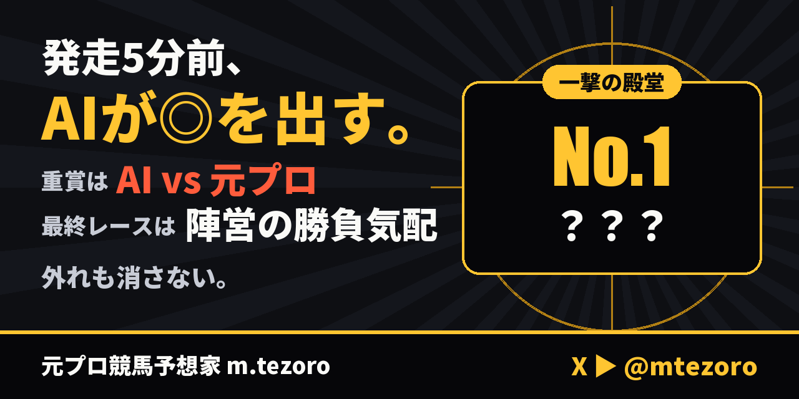

# 元プロ競馬予想家 m.tezoro｜AIの◎と陣営の勝負気配

**元プロの俺が、自分で育てたAIを走らせる。**  
土日の発走5分前に、AIの◎を出す。  
重賞の日は朝10時に元プロの勝負馬券を先に出し、発走5分前に1本の札で **AI vs 元プロ**🥊  
開催日は、各場の最終レースの発走30分前に元プロの◎△と陣営の勝負気配🐎  
X ▶ [@mtezoro](https://x.com/mtezoro)

## 約束

- 発走前に全部見せる
- 外れも消さない

## ⏰ AIの◎

全部の◎は発走前に `m1_picks.csv` へ、結果は `m1_results.csv` へ。10/10 から、レースごとに「○戦○勝」で数えます。
投稿は印 ◎○▲△ だけ。買い方は決まった7つから選べます：三連単マルチ ◎軸○▲△・三連単 ◎→○▲→○▲△・三連複 ◎-○▲△・馬単 ◎→○▲・馬連 ◎-○▲・ワイド ◎-○▲・単勝 ◎（元プロの印は○▲△を△4頭で）。
各1点1万円で `bets.csv` に記録し、当たったらすぐ速報🎯。回収率は1か月以上でプラスの買い方だけ。

## 🥊 重賞の札（AI vs 元プロ）

元プロの勝負馬券は重賞の日の朝10時に先に出して `pro_picks.csv` へ。発走5分前の札でも同じ券で勝負します。
勝ち負けと通算の星取りは `vs.csv`、元プロの結果は `pro_results.csv` に残します。

## 🐎 陣営の1行

AIの◎・重賞の札に、一流の陣営のしるしが出たら「🐎陣営：」の1行。最終レースは元プロの◎と△から2頭まで。今季の一流（調教師10人・騎手10人）は [`今季の一流.csv`](今季の一流.csv)。

## 💥 一撃の殿堂

発走前に X に出したAIの◎が勝って、単勝の払戻が1,000円以上で殿堂入り。番号を付けて `ichigeki.csv` へ。

## 🐣 明日の新馬（POG）

新馬戦の前の夜に、翌日デビューの全頭の順位を `pog_picks.csv` に記録します。X には AI の評価 S と A を「明日の新馬」で。POG の指名（1季10頭）の勝ち上がりは、月に1回 `pog_results.csv` へ。

## 📖 はじまりの話

10/4、AIは京都大賞典の ◎12 エコロディノスを選んで1着（単勝2,900円）。  
10/10 から、AIの◎は全部、発走前に記録します。

---
決まりとファイルの説明は [決まり.md](決まり.md)
